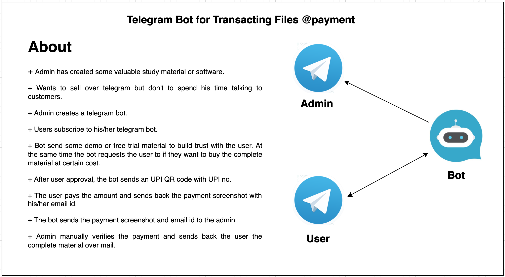

## Telegram Bot for Transacting Files @payment

## To run
* Clone the repo
* `cd ConductBusinessWithTelegramBot`
* Subscribe to `@BotFather` on telegram.
* Create a bot and get your bot token.
* Paste the bot token in `bot.py` `(line:7)`
* Replace the upi.png with the actual UPI QR image and edit the filename in `bot.py` `(line:11)`
* Subscibe to `@chatid_echo_bot` and know your `chaid`
* Paste the `chatid` in `bot.py` `(line:8)`
* Also, edit `bot.py` `(line:9-10-12)` with the required details as per your need.
* RUN: `python3 main.py`

## Test
* Ask your friend to subscribe to your bot and follow the process as discussed in the above image.

## Tips
* Host the bot on PythonAnywhere, it's free.